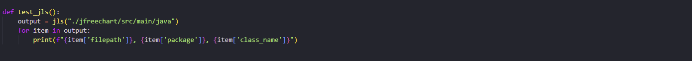
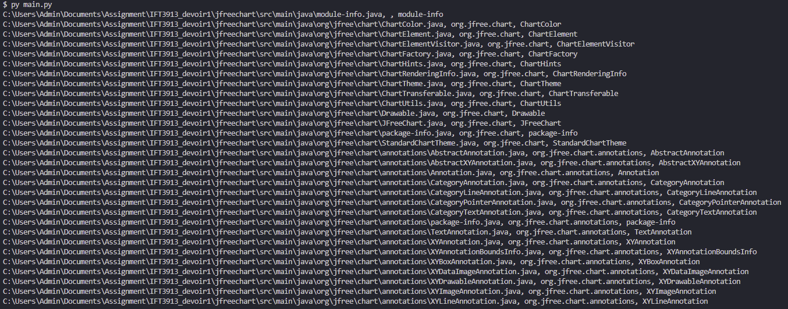
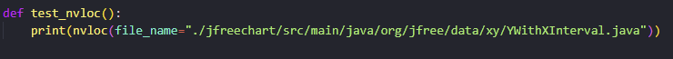
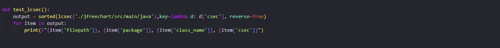
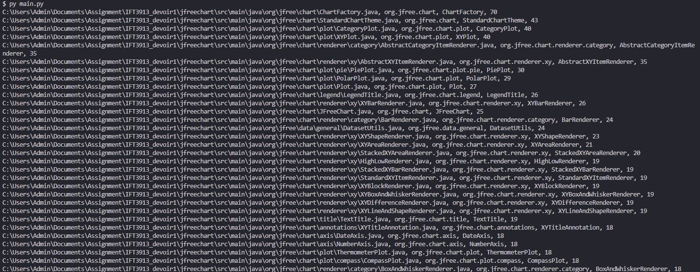

# IFT3913_devoir1

## Requirements
This project requires Python 3.10 installed on your system

## File Structure
> `main.py` - This file contains functions to run all the other files

>`jls/main.py` -  This contains the functionality of Part 0 of the assignment. When called the function expects folder path as input argument and returns `list` of `dict`s which contains the required `file_path`, `filename`, and `class name`

>`nvloc/main.py` -  This contains the functionality of Part 1 of the assignment. When called the function expects file path as input argument and returns `nvloc` of the supplied file

>`lcsec/main.py` -  This contains the functionality of Part 2 of the assignment. When called the function expects folder path as input argument and returns `list` of `dict`s which contains the required `file_path`, `filename`, `class name` and corresponsing `csec` value

>`egon/main.py` -  This contains the functionality of Part 3 of the assignment. When called the function expects folder path as input argument and returns `list` of `dict`s which contains the required `file_path`, `filename`, `class name` and corresponsing `csec` and `nvloc` values

## Testing and Running
### 1. Part 0 - JLS Program
Function to test the running of the Program

The snapshot of the output below proves it produced an accurate output

---

### 2. Part 1 - NVLOC Program
Function to test the running of the Program

The snapshot of the output below proves it produced an accurate output

### 3. Part 2 - LCSEC Program
Function to test the running of the Program

The snapshot of the output below proves it produced an accurate output

